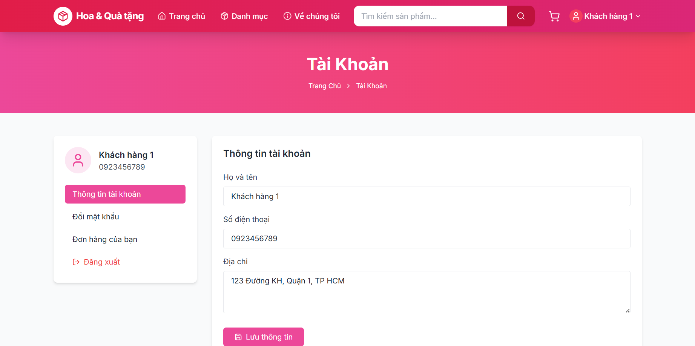
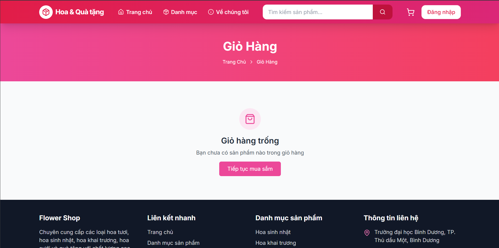
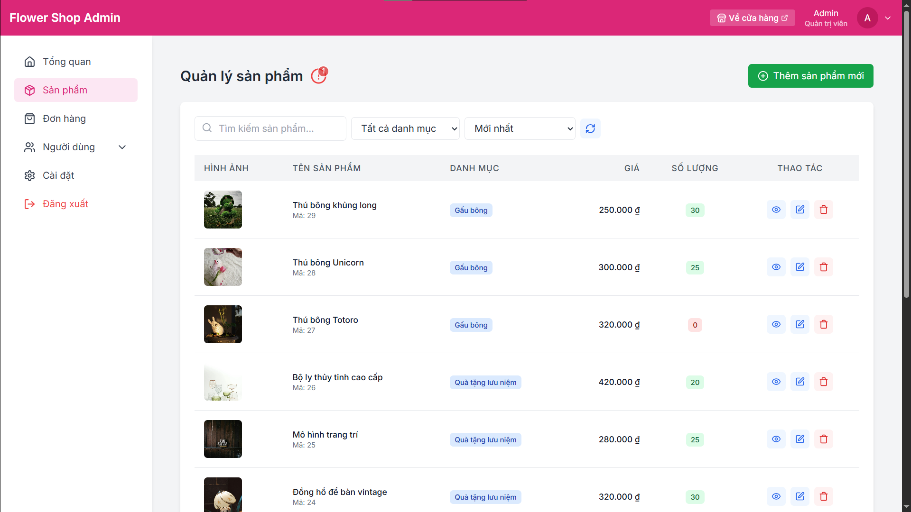

# 🛍️ Shop App - React E-commerce Solution

[](https://github.com/BlackDeathWind/shop-app/releases)
[](LICENSE)

**Ứng dụng web giao hoa và quà tặng**.

> **Live Demo**: (Hiện chưa có) (Google Drive)

## 🚀 Tính Năng Nổi Bật

| Module         | Chi Tiết                                                                 |
|----------------|--------------------------------------------------------------------------|
| **Xác thực**   | Đăng nhập/Đăng ký với API backend truy vấn tới MySQL 8                   |
| **Sản phẩm**   | Danh sách sản phẩm đa danh mục, Tìm kiếm, Lọc,                           |
| **Giỏ hàng**   | Quản lý giỏ hàng bằng weblocal (không phải lưu trong cơ sở dữ liệu)      |
| **Thanh toán** | Hoá đơn, Cập nhật số lượng sản phẩm khi thanh toán thành công            |
| **Hồ sơ**      | Theo dõi đơn hàng, Lịch sử mua hàng, Cập nhật thông tin cá nhân          |
| **Quản trị**   | CRUD sản phẩm (Admin Dashboard + Nhân viên Dashboard - riêng biệt)       |

## 📱 Hình Ảnh Demo Một Vài Chức Năng Cơ Bản

| Trang Chủ            | Hồ Sơ               | Đăng ký người bán |
|----------------------|---------------------|-------------------|
|  |  |  |

| Thanh Toán          | Giỏ Hàng            | Hoá đơn            |
|---------------------|---------------------|--------------------|
|  |  |  |

| Admin Dashboard     | Quản lý sản phẩm    | Quản lý đơn hàng   |
|---------------------|---------------------|--------------------|
|  |  |  |

## 🛠 Công Nghệ Sử Dụng


**Frontend Framework**  
- React 19 (TypeScript)
- Vite (cho phát triển React + TypeScript)

**Backend**
- Node.js – Nền tảng chạy server-side JavaScript.
- Express.js – Framework xây dựng chính cho backend, tổ chức theo mô hình MVC.
- TypeScript – Dễ bảo trì, phát triển lâu dài.
- Sequelize ORM – Quản lý truy vấn và ánh xạ dữ liệu giữa Node.js và cơ sở dữ liệu.
- JWT (JSON Web Token) – Xác thực và phân quyền người dùng (Admin - Nhân viên - Khách hàng).
- Multer – Xử lý upload file (hình ảnh sản phẩm).
- Bcrypt – Mã hoá mật khẩu người dùng trong MySQL.
- CORS, Helmet, v.v. – Bảo mật API.

**Database**
- MySQL 8 – Lưu trữ dữ liệu (driver `mysql2`).
- Sequelize – ORM mapping giữa các model TypeScript và bảng dữ liệu.

**UI/UX Libraries**  
- Tailwind CSS – Framework CSS utility-first.
- Lucide React – Bộ icon vector hiện đại.
- Custom Toast/Notification – Hệ thống thông báo.
- React Router DOM v7 – Routing động, bảo vệ route, phân quyền truy cập.
- Context API + Custom Hooks – Quản lý trạng thái xác thực, giỏ hàng, toast, v.v.

**Payment (thanh toán)**  
- Thanh toán giả lập, không thật (Test Mode).

## ⚙️ Cài Đặt Dự Án

### Yêu Cầu Hệ Thống
- Node.js (>= 14)

### Bước 1: Clone repository (tải dự án này về máy, bật Terminal của Visiual Studio Code hoặc các IDE khác để nhập lệnh)
```bash
git clone https://github.com/BlackDeathWind/shop-app.git
cd shop-app
```

### Bước 2: Cài đặt dependencies
```bash
# Tham chiếu đến thư mục frontend bằng cách:
cd frontend
```
```bash
# Sau khi tới đường dẫn frontend rồi thì thiết lập thư viện cần thiết (yêu cầu có ứng dụng Node.js trong máy):
npm install
```
```bash
# hoặc (Tuỳ, nhưng khuyến khích npm install)
yarn install
```
```bash
# Sau đó quay về thư mục gốc bằng cách:
cd ..
```
```bash
# Tiếp theo tham chiếu đến thư mục backend bằng cách:
cd backend
```
```bash
# Sau đó thiết lập thư viện cần thiết (yêu cầu có ứng dụng Node.js trong máy):
npm install
```

### Bước 3: Khởi chạy ứng dụng (lưu ý khởi chạy cả 2 frontend và backend cùng một lúc)
```bash
# ở Console Terminal frontend (cd frontend):
npm run dev
```
```bash
# ở Console Terminal backend (cd backend):
npm run dev
```
- Frontend sẽ chạy ở http://localhost:5173/
- Backend sẽ chạy ở http://localhost:5000/

## 📁 Cấu Trúc Thư Mục Chính
```bash
── src/
    ├── config/          # Cấu hình hệ thống, database
    ├── controllers/     # Controller xử lý request/response
    ├── interfaces/      # Định nghĩa interface, kiểu dữ liệu
    ├── middlewares/     # Middleware xác thực, upload, ...
    ├── models/          # Định nghĩa model ORM (Sequelize)
    ├── routes/          # Định nghĩa các route (endpoint)
    ├── services/        # Xử lý logic nghiệp vụ, truy vấn DB
    └── utils/           # Hàm tiện ích, helper, logger, ...
```

## 🔧 Biến Môi Trường (MySQL 8)
Trong thư mục `backend`, tạo file `.env` với nội dung mẫu sau (điều chỉnh theo máy của các bạn):
```env
PORT=5000
NODE_ENV=development

# Database (MySQL 8)
DB_HOST=127.0.0.1 # <--- 127.0.0.1 là localhost. DB_HOST=db.example.com: MySQL trên server từ xa (hosting, cloud)
DB_PORT=3306 # <--- Chỉnh nếu MySQL trên server từ xa (hosting, cloud)
DB_NAME=shop
DB_USER=root # <--- nếu tên instance của các bạn không phải root thì điều chỉnh
DB_PASSWORD=<mật_khẩu_mysql> # <--- Phần điều chỉnh

# JWT
JWT_SECRET=shopapp_secret_key # <--- Phần điều chỉnh (đặt tuỳ ý)
JWT_REFRESH_SECRET=shopapp_refresh_secret # <--- Phần điều chỉnh (đặt tuỳ ý)

# Frontend URL (cho CORS/cookie)
FRONTEND_URL=http://localhost:5173 # <--- Chỉnh nếu giao diện frontend trên server từ xa (hosting, cloud)
```

## 🗄️ Cơ sở dữ liệu (MySQL 8) – Khởi tạo dữ liệu mẫu
Trong thư mục gốc dự án shop-app mình đã để sẵn 3 tệp SQL cho MySQL 8:
- `1_create_schema.sql`
- `2_create_tables.sql`
- `3_insert_sample_data.sql`

Chạy tệp theo thứ tự 1 → 2 → 3 ở Workbench hoặc bằng MySQL client (ví dụ dòng lệnh):
```bash
mysql -u root -p < 1_create_schema.sql
mysql -u root -p shop < 2_create_tables.sql
mysql -u root -p shop < 3_insert_sample_data.sql
```

Sau đó chạy backend và frontend như ở phần Cài Đặt Dự Án. Khi đăng nhập admin/staff, các bạn có thể CRUD sản phẩm, đơn hàng, người dùng; dữ liệu sẽ được ghi/đọc từ MySQL 8.

> Đã chuyển đổi thành công từ SQL Server sang MySQL 8. Toàn bộ CRUD đã hoạt động ổn định, không còn lỗi.

## 👨‍💻 Tác Giả
**Phạm Nguyễn Chu Nguyên - 21050043**  
[](https://github.com/BlackDeathWind)
[](https://www.linkedin.com/in/ph%E1%BA%A1m-nguy%E1%BB%85n-chu-nguy%C3%AAn-822204375/)

## 📜 Giấy Phép
Dự án được cấp phép theo [MIT License](LICENSE)
```
## 💡 Lưu Ý Quan Trọng
Bước Cài đặt dependencies và bước thiết lập Biến Môi Trường
```

2. **Performance Optimization**: Đã áp dụng các kỹ thuật:
   - Lazyload cho mục đích load sản phẩm lên giao diện mượt mà thay vì load toàn bộ cùng một lúc và liên tiếp như vậy.
   - Code splitting từng tệp để dễ quản lý và bảo trì

3. **Các vấn đề đang phát triển (Kinh nghiệm và hạn chế)**:
   - Chưa có kinh nghiệm xây dựng các lớp bảo mật nhiều tầng cho dự án dạng e-commerce này.
   - Chưa Deloy (triễn khai dự án) lên AWS hay Vercel (hiện chạy localhost).
   - Chưa có kinh nghiệm xử lý thanh toán thật.
